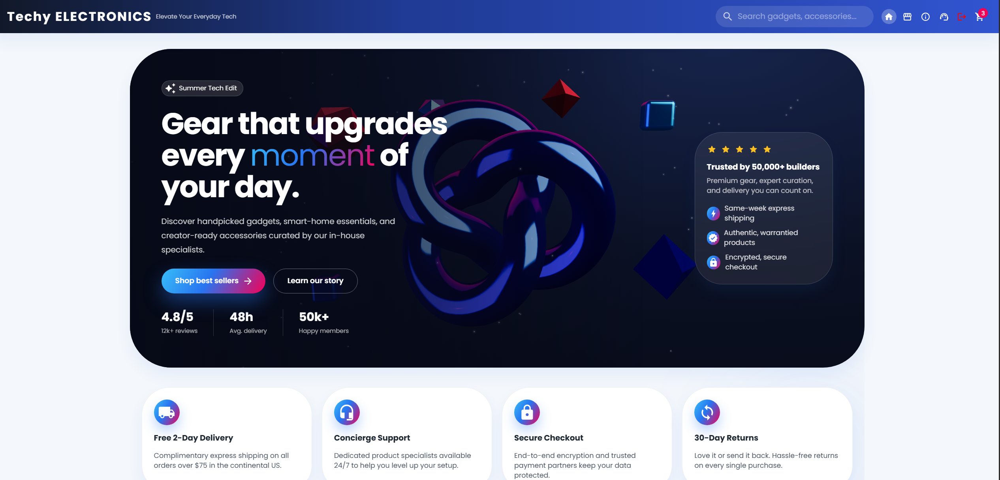
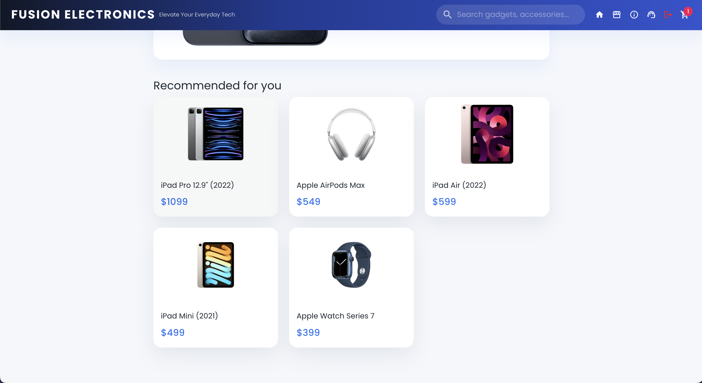
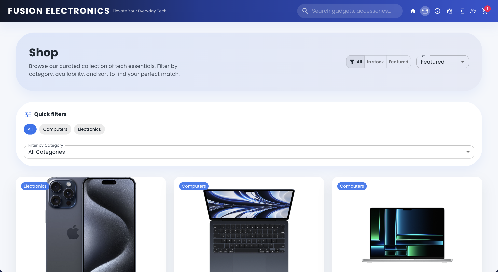
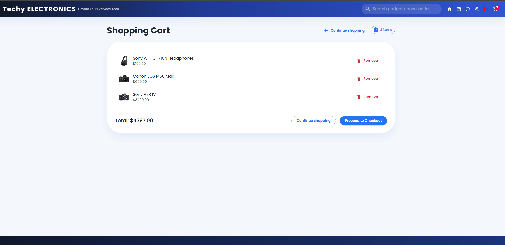
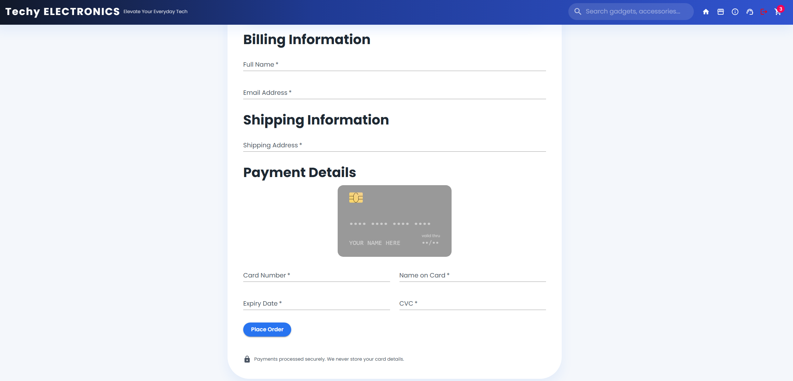
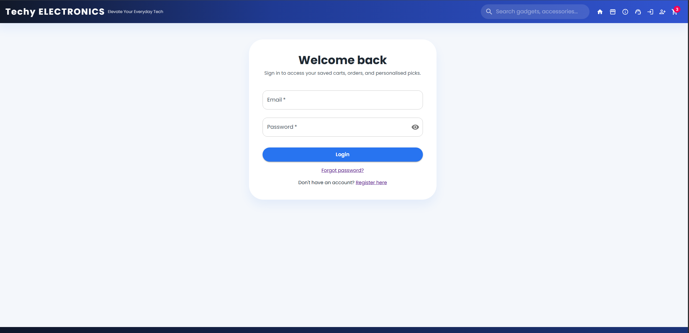
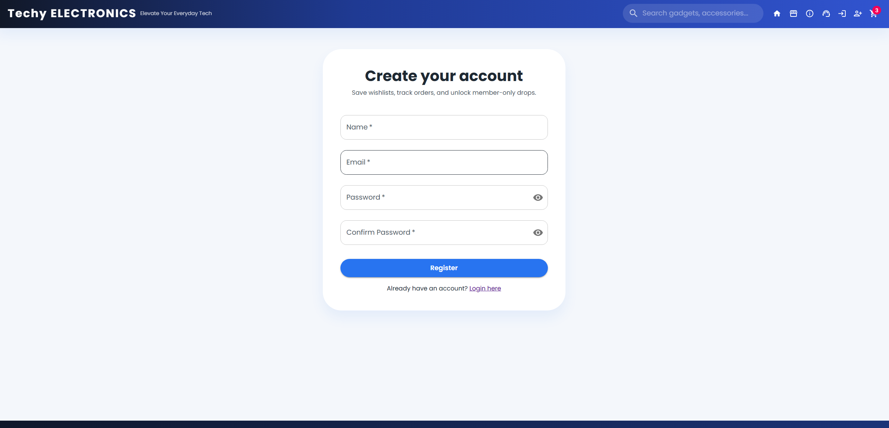

# Techy Electronics — MERN Stack E-Commerce Website

<p align="center">
  
</p>

<p align="center">
  A full-stack e-commerce web application built with the MERN stack.
</p>

<p align="center">
  <a href="https://tech-ecommerce-app.vercel.app">Live Demo</a>
  ·
  <a href="https://github.com/Maliksarmad01/Techy-Electronics-MERN-website">GitHub Repository</a>
</p>

---

## 📌 Overview

**Techy Electronics** is a full-stack e-commerce application built using the **MERN stack — MongoDB, Express.js, React.js, and Node.js**.

The application provides a complete online shopping experience including product browsing, search, authentication, shopping cart management, checkout, order tracking, and product recommendations.

The project also includes backend API documentation, automated testing, vector-based product recommendations, Docker configuration, and CI/CD support.

---

## 🚀 Live Demo

### Frontend

**Techy Electronics:**
https://tech-ecommerce-app.vercel.app

### Backend API

**Techy Electronics API:**
https://tech-electronics-api.vercel.app/

> **Note:** The backend may take a few seconds to respond if it has been inactive.

---

## ✨ Features

### 🛍️ Product Management

* Browse available products
* View detailed product information
* Search products
* Filter and sort products
* Product pagination
* Product recommendations
* Similar product suggestions

### 🛒 Shopping Cart

* Add products to cart
* Remove products from cart
* View cart items
* Calculate total amount
* Update cart contents

### 💳 Checkout

* Billing information
* Shipping information
* Payment information
* Client-side credit card validation
* Card type detection
* Expiry date validation
* CVC validation
* Email validation
* Order creation
* Order confirmation

> This project simulates the checkout process. No real payment is processed.

For testing card validation, the project supports:

```text
4242 4242 4242 4242
```

Use any future expiry date and any CVC.

### 🔐 Authentication

* User registration
* User login
* JWT authentication
* Password hashing
* Protected routes
* Forgot password
* Reset password
* User profile management
* Order history

### 🔎 Product Search

* Search by product name
* Search by description
* Search by brand
* Search by category
* Search suggestions
* Filtering
* Sorting
* Pagination
* Debounced search

### 🤖 Product Recommendations

The application supports vector-based product recommendations using:

* Pinecone
* Weaviate
* FAISS
* LangChain

Pinecone is used as the primary vector database for the recommendation system.

### 📦 Order Management

* Order confirmation
* Order history
* Order tracking
* Order status
* Estimated delivery information

### 📱 Responsive UI

The frontend is designed to work across:

* Desktop
* Tablet
* Mobile

---

## 🖥️ User Interface

### Home Page



### Recommended Products



### Products



### Product Details


### Shopping Cart



### Checkout



### Login



### Register



---

## 🛠️ Technologies Used

### Frontend

* React.js
* Material UI
* Axios
* React Router
* React Hook Form
* React Toastify
* React Credit Cards
* Jest
* React Testing Library

### Backend

* Node.js
* Express.js
* MongoDB
* Mongoose
* JWT
* bcrypt
* dotenv
* CORS
* Swagger
* Nodemon

### Recommendation System

* Pinecone
* Weaviate
* FAISS
* LangChain

### Development & Deployment

* Git
* GitHub
* npm
* Docker
* GitHub Actions
* Vercel
* Render

---

## 📁 Project Structure

```text
Techy-Electronics-MERN-website/
│
├── backend/
│   ├── config/
│   │   └── db.js
│   │
│   ├── docs/
│   │   └── swagger.js
│   │
│   ├── middleware/
│   │   └── auth.js
│   │
│   ├── models/
│   │   ├── user.js
│   │   ├── product.js
│   │   └── order.js
│   │
│   ├── routes/
│   │   ├── auth.js
│   │   ├── products.js
│   │   ├── orders.js
│   │   ├── checkout.js
│   │   └── search.js
│   │
│   ├── scripts/
│   │   ├── build-faiss-index.js
│   │   ├── search-faiss-index.js
│   │   └── sync-pinecone.js
│   │
│   ├── seed/
│   │   └── productSeeds.js
│   │
│   ├── services/
│   │   ├── embeddingService.js
│   │   └── pineconeSync.js
│   │
│   ├── index.js
│   ├── package.json
│   └── package-lock.json
│
├── public/
│   ├── index.html
│   ├── manifest.json
│   └── robots.txt
│
├── src/
│   ├── components/
│   ├── context/
│   ├── pages/
│   ├── services/
│   ├── tests/
│   ├── App.jsx
│   ├── App.css
│   └── index.js
│
├── docs/
├── deployment/
├── kubernetes/
├── nginx/
│
├── .github/
│   └── workflows/
│
├── .gitignore
├── docker-compose.yml
├── Dockerfile
├── package.json
├── package-lock.json
├── jsconfig.json
├── openapi.yaml
└── README.md
```

---

## ⚙️ Getting Started

### Prerequisites

Make sure you have installed:

* Node.js
* npm
* MongoDB
* Git

---

## 📥 Installation

Clone the repository:

```bash
git clone https://github.com/Maliksarmad01/Techy-Electronics-MERN-website.git
```

Navigate into the project:

```bash
cd Techy-Electronics-MERN-website
```

### Install Frontend Dependencies

```bash
npm install
```

### Install Backend Dependencies

```bash
cd backend
npm install
cd ..
```

---

## 🔐 Environment Variables

Create a `.env` file inside the `backend` directory.

Example:

```env
MONGO_URI=your_mongodb_connection_string
JWT_SECRET=your_jwt_secret

PINECONE_API_KEY=your_pinecone_api_key
PINECONE_HOST=your_pinecone_host
PINECONE_INDEX=ecommerce-products
PINECONE_NAMESPACE=ecommerce-products

GOOGLE_AI_API_KEY=your_google_ai_api_key
PINECONE_PURGE_ON_SYNC=true
```

### Important

Do **not** commit your real `.env` file to GitHub.

Use `.env.example` to document the required environment variables.

---

## 🗄️ Database Setup

Make sure MongoDB is running and your `MONGO_URI` is correctly configured.

To seed the database with sample products:

```bash
cd backend/seed
node productSeeds.js dev
```

Then return to the backend directory:

```bash
cd ..
```

---

## ▶️ Running the Application

### Start Backend

From the `backend` directory:

```bash
npm start
```

The backend API will run on:

```text
http://localhost:5000
```

### Start Frontend

Open another terminal and navigate to the project root:

```bash
npm start
```

The frontend will run on:

```text
http://localhost:3000
```

Open your browser and visit:

```text
http://localhost:3000
```

---

## 🔎 API

Products API:

```text
http://localhost:5000/api/products
```

Swagger API documentation:

```text
http://localhost:5000/api-docs
```

---

## 🧠 Vector Product Recommendations

The recommendation system uses vector similarity to provide relevant products.

### Pinecone

Configure the following variables:

```env
PINECONE_API_KEY=your_api_key
PINECONE_HOST=your_host
PINECONE_INDEX=ecommerce-products
PINECONE_NAMESPACE=ecommerce-products
GOOGLE_AI_API_KEY=your_google_ai_api_key
```

Then run:

```bash
cd backend
npm run sync-pinecone
```

The application can synchronize product information and embeddings with Pinecone.

---

## 🧪 Testing

The project includes backend and frontend tests using **Jest** and **React Testing Library**.

### Backend Tests

```bash
cd backend
npm test
```

### Frontend Tests

From the project root:

```bash
npm test
```

### Test Coverage

```bash
npm run test:coverage
```

### Snapshot Tests

```bash
npm test -- src/tests/snapshots
```

---

## 📚 API Documentation

The backend provides Swagger API documentation.

After starting the backend, open:

```text
http://localhost:5000/api-docs
```

The project also includes an OpenAPI specification:

```text
openapi.yaml
```

---

## 🐳 Docker

The project includes Docker configuration.

To build and run the application:

```bash
docker compose up --build
```

---

## 🔄 CI/CD

GitHub Actions configuration is included in:

```text
.github/workflows/
```

The workflow can be used to automate testing and build processes when changes are pushed to GitHub.

---

## 🚀 Deployment

The application can be deployed using platforms such as:

* Vercel
* Render
* AWS
* Docker
* Kubernetes

Deployment-related configuration and documentation are available in:

```text
DEPLOYMENT.md
```

---

## 🔒 Security

The project uses:

* JWT authentication
* Password hashing with bcrypt
* Protected API routes
* Environment variables for sensitive configuration
* CORS configuration
* Input validation

**Never upload API keys, database credentials, JWT secrets, or other sensitive environment variables to GitHub.**

---

## 🤝 Contributing

Contributions and improvements are welcome.

1. Fork the repository
2. Create a new branch

```bash
git checkout -b feature/new-feature
```

3. Make your changes
4. Commit your changes

```bash
git commit -m "Add new feature"
```

5. Push the branch

```bash
git push origin feature/new-feature
```

6. Open a Pull Request

---

## 📄 License

This project is licensed under the **MIT License**.

See the `LICENSE` file for more information.

---

## 👨‍💻 Developer

**Muhammad Sarmad Sajjad**

GitHub:
https://github.com/Maliksarmad01

---

## ⭐ Support

If you find this project useful, consider giving the repository a ⭐ on GitHub.

**Happy coding! 🚀**
